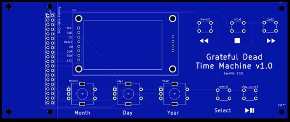

# Build Your Own Grateful Dead Time Machine

## Parts List

### Grateful Dead Time Machine Board
The easiest way to get a Time Machine working is to use the custom printed circuit board, along with the components in this page. 

To obtain a Time Machine Board, send an email to [gdtimemachine@gmail.com](mailto:gdtimemachine@gmail.com)

### Raspberry Pi

The [Raspberry Pi 3 A+](https://www.adafruit.com/product/4027?gclid=CjwKCAjw9r-DBhBxEiwA9qYUpRtAxcMfSCYvHXumkkVY1CEXW6kAsdKQHBr-JPaOwqJELiOx9J3UohoCxocQAvD_BwE) is probably the best for this task. It will be significantly faster than the Zero, and relatively inexpensive (about $25).

### Micro SD card
16 GB is more than sufficient. I have not tested 8 GB, but I would guess that will work also.

### Raspbian Lite OS 
You need to install the raspbian Lite operating system on the Micro SD card.
Visit [this site](https://www.raspberrypi.org/software/) and download and install the image for Raspbian Lite onto the SD card.

### Knobs
[Rotary Encoder Code Switch Digital Potentiometer with Push Button](https://www.amazon.com/gp/product/B07MW7D4FD/ref=ppx_od_dt_b_asin_title_s00?ie=UTF8&psc=1). These cost about $12 for 10 knobs.  You only need 3, and you can find similar ones in smaller batches. Just make sure they have 5 pins and 2 mechanical mounting points.

### Display
The time machine uses a 128 x 160 pixel display. There are many similar/equivalent displays which work with the same driver, but have different pinouts. If you are using the Time Machine Printed Circuit Board, then make sure to get this one, which has 8 pins as shown.

[1.8" SPI TFT LCD Display Module 3.3V 5.5V 128×160 SPI TFT LCD Serial Port Display Module ST7735 51/AVR/STM32/ARM 8/16 bit](https://www.amazon.com/gp/product/B07R413JTD/ref=ppx_yo_dt_b_asin_title_o00_s00?ie=UTF8&psc=1). Cost: about $15.

### Buttons
These buttons are pretty standard, and work with the Grateful Dead Time Machine printed circuit board
[Tactile Switch Buttons (12mm square, 6mm tall) x 10 pack](https://www.adafruit.com/product/1119)

### Screws

The screw size for the raspberry pi and the accessories is M 2.5

A set of [nylon screws, nuts, and standoffs](https://www.amazon.com/dp/B07XJWF7HM?psc=1&smid=A3EBPEC0WM8MKE&ref_=cm_sw_r_apa_typT1_K9zzGb047TKXE) comes in handy.

### 40-pin Connector

You will only need one of these, but this is for a set of 20!
[Antrader 20pcs Dual Female Pin Header Socket Connector Strip](https://www.amazon.com/gp/product/B07D48WZTR/ref=ppx_yo_dt_b_asin_image_o00_s00?ie=UTF8&psc=1)

## Hard Core Do It Yourself:
If you are a maker and want to avoid using the Printed Circuit Board (you may want a different layout, for example), then here are the pinouts which will help you build it. Please let me know if there are any errors here, but it should be very very close.

### The code

### Cables

Initially, I bought these 4 inch wires, and made everything work with them.
[Antrader Breadboard Jumper Wires 40 Pin 10CM Female to Female for Raspberry Pi](https://www.amazon.com/gp/product/B07S2RH6Q4/ref=ppx_yo_dt_b_asin_title_o02_s00?ie=UTF8&psc=1)

Later, I got some [longer cables](https://www.amazon.com/gp/css/order-history/?ref=hud_2_gw_profile&pf_rd_r=1S6RZWWF1FV05B018T15&pf_rd_p=c4efc2fd-1905-4a86-8886-de915cdfff8c&pd_rd_r=b3108073-280e-4832-84f0-8a681df30dec&pd_rd_w=8ihb1&pd_rd_wg=XolWJ&ref_=pd_gw_unk) which I will use next time around, so that I have more flexibility in placing components in the box.

## Pinouts

### sound card pinout

The sound card passes the RPi pins through the board. The power and ground are clearly labelled, but these are the mappings that I beeped out for the other pins.

| Audio Label | Audio pin | RPi pin | GPIO | current use |
| - | - | - | - | - | - | 
| SDA | 1 | 3 | 2 (SDAI2C)| stop button|
| SCL | 2 | 5 | 3 (SCLI2C) | rewind button |
| TX | 3 | 8 | 14 (UART TX) |
| RX | 4 | 10 | 15 (UART RX) |
| 4 | 5 | 7 | 4 | select button | 
| 17 | 6 | 11 | 17 | day dt |
| 18 | 7 | 12 | 18 (used by Audio Card!!!) |  | 
| 27 | 8 | 13 | 27 | day sw | 
| 22 | 9 | 15 | 22 | year dt |
| 23 | 10 | 16 | 23 | year sw |
| 23 | 11 | 18 | 24 (screen A0)| screen A0 | 
| 25 | 12 | 22 | 25 (screen reset)| screen reset |
| MOS | 13 | 19 | 10 (MOSI) (screen SDA) | screen SDA |
| MIS | 14 | 21 | 9 (MISO) | 
| CLK | 15 | 23 | 11 (SCLK) (screen SCK) | screen SCK |
| CE0 | 16 | 24 | 8 (CE0_N) (screen CS) | screen CS |
| CE1 | 17 | 26 | 7 (CE1_N) |  
| 5 | 18 | 29 | 5 | month dt |
| 6 | 19 | 31 | 6 | month sw | 
| 12 | 20 | 32 | 12 | month cl |
| 13 | 21 | 33 | 13 | day cl |
| 16 | 22 | 36 | 16 | year cl |
| 19 | 23 | 37 | 26 |  ffwd button |
| 20 | 24 | 38 | 20 |  play/pause button |
| 21 | 25 | 40 | 21 (Used by Audio Card!!!) |

### Pinout for screen
For device pinouts through extra boards:
https://pinout.xyz/pinout/pin24_gpio8#  -- this is completely misleading, but I'll leave the link here. I just beeped out the pins using a multimeter.

| device | Device Pin | GPIO pin | RPi Pin | audio pin |
| - | - | - | - | - |
| screen | LED | 3.3V or Gnd | 1 | 3V3 or Gnd
| screen | SCK | GPIO 11 |  23 | 15
| screen | SDA | GPIO 10 | 19 | 13
| screen | A0  | GPIO 24 | 18 | 11 
| screen | RESET | GPIO 25 | 22 | 12
| screen | CS   | GPIO 8 | 24 | 16
| screen | GND  | GND | 20 | gnd
| screen | VCC  | 5V  | 2 | 5V

### Pinouts for Knobs
My current pinout for the knobs is shown below.

These are configured in the **config.py** file in the deadstream repo.

|device | device pin | GPIO pin | RPi Pin | Soundcard Pin |
| ---| -|-|-| - |
|year | cl | GPIO 16 | 36 | 22
|year | dt | GPIO 22 | 15 | 9
|year | sw | GPIO 23 | 16 | 10
| year | + |  3V3 | 17| 
| year | gnd | gnd | 39 | 
| month | cl | GPIO 12 | 32 | 20
| month | dt | GPIO 5 | 29 | 18 
| month | sw | GPIO 6 | 31 | 19
| month | + | 3V3 | 17 | 
| month | gnd | gnd | 39 |
| day | cl | GPIO 13 | 33 | 21 
| day | dt | GPIO 17 | 11 | 6 
| day | sw | GPIO 27 | 13 | 8
| day | + | 3V3 |17 | 
| day | gnd | gnd | 39 |
